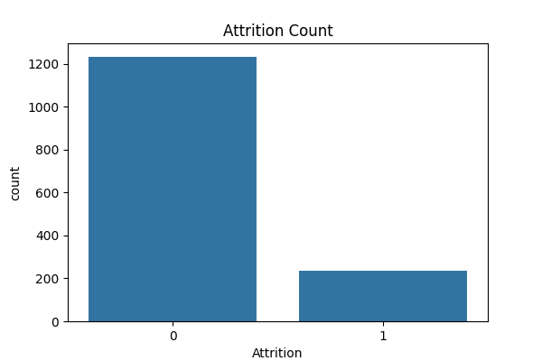
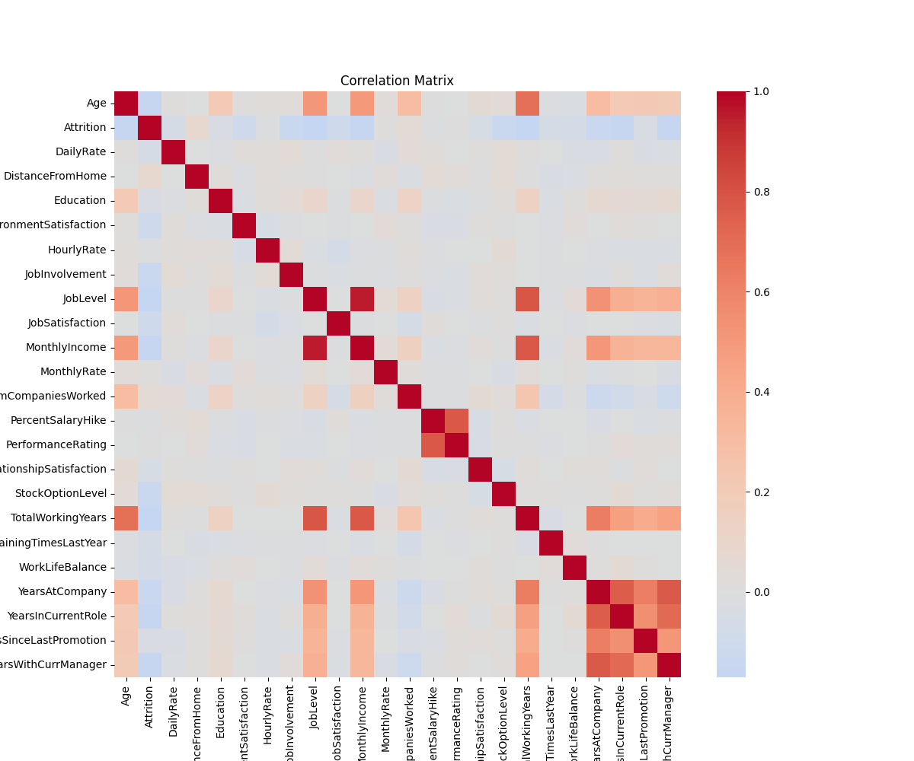
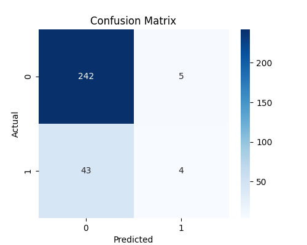
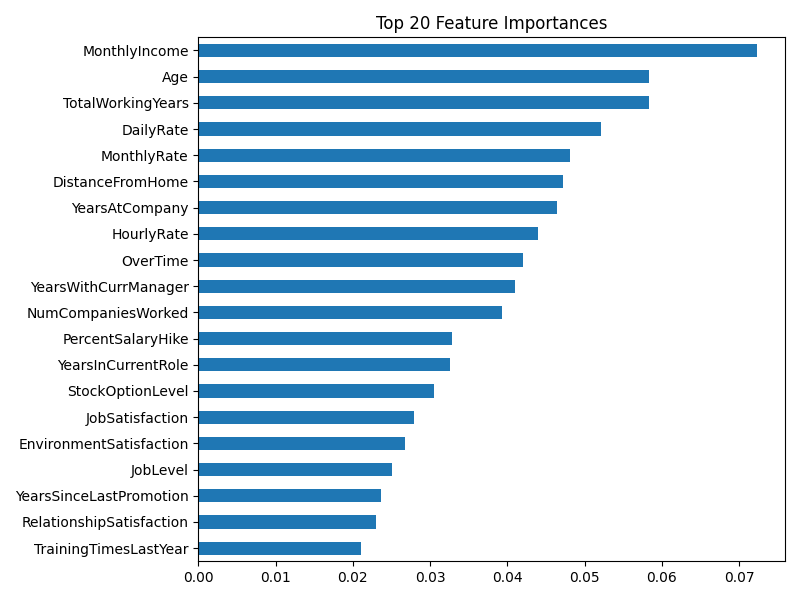

# HR Analytics: Employee Attrition Prediction

## Project Description
This project predicts employee attrition using machine learning (RandomForest). It uses the IBM HR dataset and helps HR teams understand which factors influence employees leaving the company.

## Steps Performed
1. **Data Loading:** Load IBM HR dataset CSV.
2. **Data Cleaning:** Removed duplicates and irrelevant columns; converted target to numeric.
3. **Exploratory Data Analysis (EDA):** Visualized attrition counts and correlation among numeric features.
4. **Encoding:** Converted categorical columns to numeric (label encoding + one-hot encoding).
5. **Train/Test Split:** Split dataset into training and testing sets.
6. **Model Training:** Trained a RandomForest classifier.
7. **Evaluation:** Checked accuracy, confusion matrix, classification report.
8. **Feature Importance:** Identified top features affecting attrition.
9. **Saved Model:** Model saved as `rf_attrition_model.pkl`.

## Results
- Attrition Count: 
- Correlation Matrix: 
- Confusion Matrix: 
- Feature Importance: 

## Technologies Used
- Python, Pandas, NumPy, Matplotlib, Seaborn
- Scikit-learn (RandomForestClassifier)
